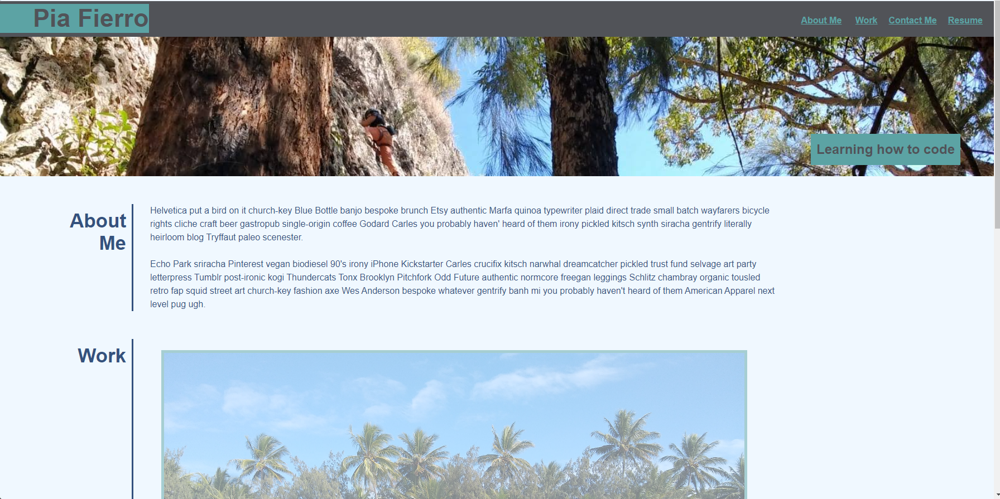

# User Story
```
As A full stack developer student
Given a Mock-Up with gift format of a porfolio example
SO THAT I can follow the Mock-Up example and built my first portfolio
```

# Portfolio Pia
```
Portfolio present with:

*Developer's name, background photo and links to portfolio content about the developer, her work and contact.
*Section about the developer history.
*Work contect section with pictures linked to projects (projects not developed yet).
*Personal contact section.
*Responsive layout that adapts to viewport.
```

# Screenshot:


# Link to deploy application:
[](https://)

